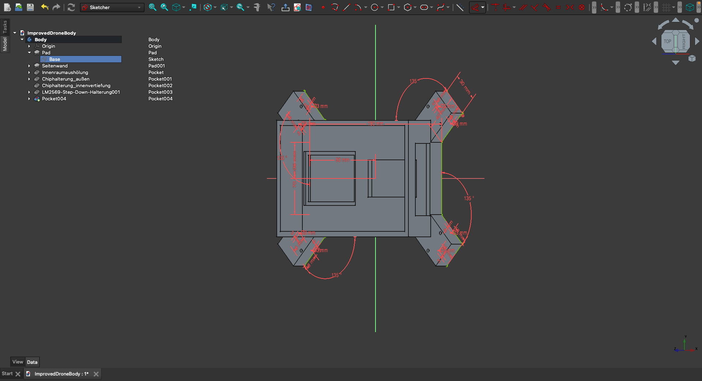
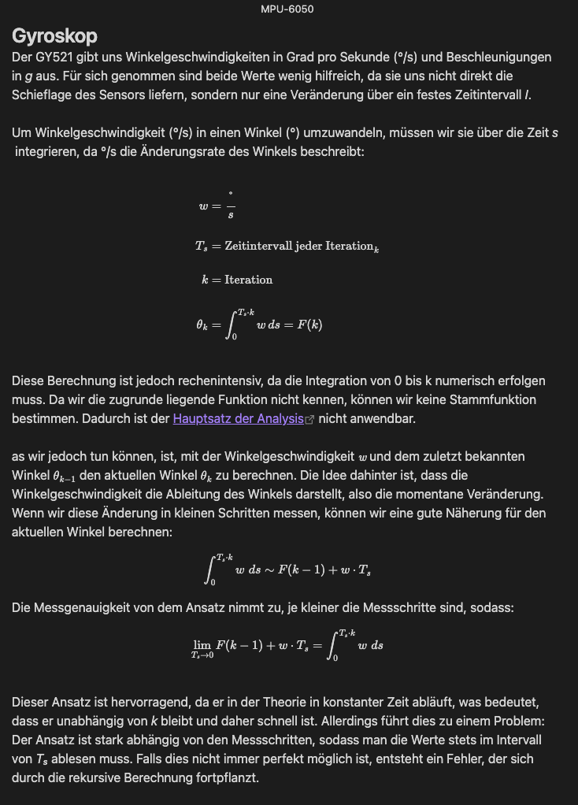

# 🚁 Custom Drone Project  

This project documents the complete process of designing, building, and programming a fully custom drone from scratch. Unlike many DIY drone projects, this one does **not** rely on any pre-existing drone components or software. Instead, every element—from hardware drivers to flight algorithms—is built from the ground up.  

## 🛠️ Project Overview  

- **Microcontroller:** ESP32 (used as the main driver)  
- **Design Software:** FreeCAD  
- **Hardware:** Fully custom-built, including motors, frame, and electronic components  
- **Software:** No pre-existing codebases; every driver is implemented based on hardware specifications  

  

## 📌 Features  

✅ **Custom Hardware Drivers** – Directly interact with components like gyrosensors and Electronic Speed Controllers (ESCs) without relying on third-party libraries.  
✅ **Fully Documented** – Every aspect of the project, from math equations to code logic, is extensively documented using comments and markdown files.  
✅ **Datasheets Included** – All hardware datasheets are attached to ensure transparency and reproducibility.  

## 🧠 Low-Level Hardware Control  

The codebase is built entirely from scratch, implementing precise control over essential components:  

- **Gyroscope Driver** – Interprets raw sensor data to maintain flight stability.  
- **ESC Control** – Generates PWM signals to regulate motor speed dynamically.  
- **Flight Algorithms** – Developed using mathematical models to achieve stable flight.  

  

## 📄 Documentation  

- **In-Depth Code Annotations** – Every function and logic structure is documented.  
- **Mathematical Derivations** – Flight physics, stabilization techniques, and control algorithms are explained.  
- **Reference Materials** – All datasheets and technical references are included.  

## ✅ Implemented Features  

- [x] ESP32-based flight controller  
- [x] Custom gyroscope driver  
- [x] Custom ESC driver  
- [x] Flight stabilization algorithms  
- [x] Complete design in FreeCAD  
- [x] Full documentation of code and math 
- [x] Custom Bump/Arena Allocator
- [x] Implement Wifi

## 📌 To-Do List
- [ ] Implement UDP or custom Data Transfer Protocol
- [ ] Implement Mulithreading
- [ ] Implement PID tuning for better flight stability
- [ ] Add remote control functionality
- [ ] Optimize power efficiency
- [ ] Improve motor calibration
- [ ] Perform real-world flight tests

## 🚀 Get Involved  

If you're interested in custom drone development, feel free to contribute, ask questions, or suggest improvements!

## Special Thanks
App Devlopment by [@MaeschDEV](https://github.com/MaeschDEV)